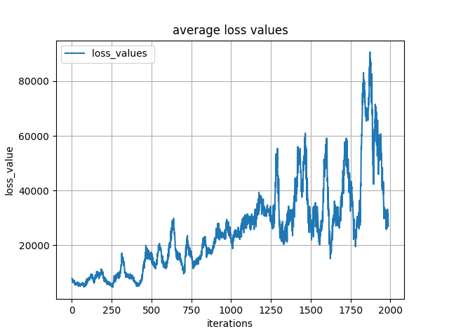
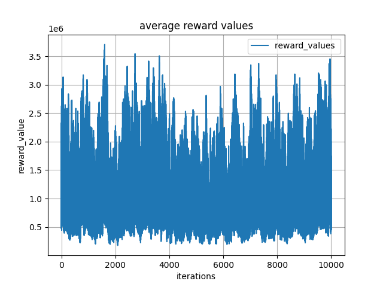

# Simulation-of-UAV-based-edge-data-processing-Dqn-based-path-planning

Doing the path planning od UAVs to take the data from IoT devices and transfer it to the cloud servers.

**Tools used**: Deep Reinforcement learning

## MEC Architecture

## About Code

Install tensorflow keras numpy mathplotlib

Simulate the path planning and data scheduling

UAVs are supposed to move straight along path in each time slot

## Results

### Training Graphs

**Graph for Average Service Urgency**

**Graph for Loss Function**

**Graph for Rewards**

### Testing Graphs

**Graph for Average Service Urgency**

**Graph for Loss Function**

**Graph for Rewards**

